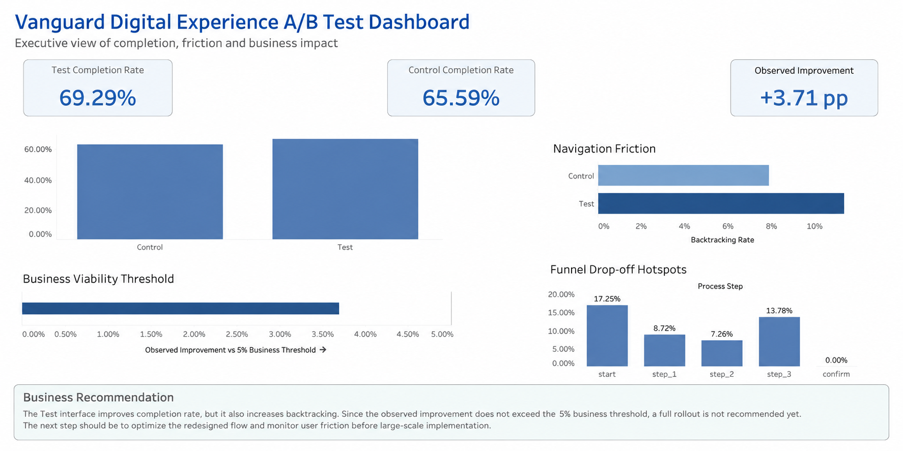

# Vanguard Digital Experience A/B Test Analysis

## Executive Summary

This project analyzes Vanguard's digital interface A/B test to evaluate whether a redesigned online experience improves user completion, reduces navigation friction, and supports a scalable business rollout.

The Test interface achieved a higher completion rate than the Control interface:

- **Test Completion Rate:** 69.29%
- **Control Completion Rate:** 65.59%
- **Observed Improvement:** +3.71 percentage points

The improvement is positive and statistically significant. However, it does not exceed the predefined **5% business viability threshold**. In addition, the Test interface also shows higher navigation friction, measured through backtracking behavior.

The final recommendation is **not to proceed with a full-scale rollout yet**. The redesigned experience should be optimized further, especially around early funnel friction, before broader implementation.

---

## Business Problem

Vanguard redesigned its digital investment process with the goal of improving the client experience and increasing the percentage of users who successfully complete the online journey.

The business needed to determine whether the new design:

- Improves completion rate.
- Reduces user friction.
- Decreases navigation errors.
- Creates enough business value to justify implementation.
- Provides a better digital experience than the traditional interface.

---

## Business Objective

The objective of this project is to analyze the A/B test results and provide a business recommendation based on user behavior, statistical testing, and dashboard insights.

The analysis focuses on answering one key question:

> Does the new digital interface perform better than the existing experience, and is the improvement strong enough to justify a full rollout?

---

## Dataset Overview

The analysis uses Vanguard digital experiment data combining client information, digital behavior, and experiment group assignment.

Main data sources include:

- **Client Profiles:** age, gender, balance, tenure, and account information.
- **Digital Footprints:** process steps, timestamps, visit behavior, and user sessions.
- **Experiment Clients:** assignment to Control or Test group.

The final Tableau-ready dataset is available as:

`vanguard_tableau_ready.csv`

A structured copy is also stored in:

`data/tableau/vanguard_tableau_ready.csv`

---

## Methodology

The project followed a full analytical workflow:

1. Business understanding.
2. Data understanding.
3. Data cleaning.
4. Feature engineering.
5. Exploratory data analysis.
6. KPI calculation.
7. Hypothesis testing.
8. Tableau dashboard development.
9. Business insights and recommendations.

The analysis was developed using Python notebooks and Tableau.

---

## A/B Test Results

### Completion Rate

The Test group outperformed the Control group in completion rate:

| Group | Completion Rate |
|---|---:|
| Control | 65.59% |
| Test | 69.29% |

The observed improvement was:

**+3.71 percentage points**

This indicates that the redesigned interface improves the likelihood of users completing the process.

---

### Business Viability Threshold

Although the Test group performed better, the observed improvement did not exceed the predefined business threshold:

| Metric | Value |
|---|---:|
| Observed Improvement | +3.71 pp |
| Business Threshold | 5.00% |

This means that the redesign shows positive performance but does not yet provide enough business justification for a full-scale rollout without further optimization.

---

### Navigation Friction

The Test experience also increased backtracking behavior:

| Group | Backtracking Rate |
|---|---:|
| Control | 7.82% |
| Test | 11.34% |

This suggests that users in the Test interface were more likely to move backward in the journey, indicating possible confusion, hesitation, or friction in the redesigned flow.

---

### Funnel Drop-off Hotspots

The funnel analysis identified the main drop-off points in the user journey:

| Process Step | Drop-off Rate |
|---|---:|
| start | 17.25% |
| step_1 | 8.72% |
| step_2 | 7.26% |
| step_3 | 13.78% |
| confirm | 0.00% |

The highest drop-off occurs at the beginning of the funnel and before confirmation, suggesting that early-stage clarity and late-stage confidence are critical areas for improvement.

---

## Tableau Executive Dashboard

The final Tableau dashboard summarizes the key business findings in an executive format.



The dashboard includes:

- Completion rate comparison.
- Navigation friction by group.
- Business viability threshold.
- Funnel drop-off hotspots.
- Final business recommendation.

The Tableau workbook is available in the repository:

`Vanguard_AB_Test_Executive_Dashboard.twbx`

---

## Business Insights

The main insights from the analysis are:

- The Test interface improves completion rate compared to the Control interface.
- The improvement is statistically significant.
- The observed improvement remains below the 5% business threshold.
- The Test interface increases backtracking behavior.
- The main funnel friction appears at the start of the process and before confirmation.
- The redesign has potential, but it requires optimization before full rollout.

---

## Business Recommendation

The Test interface should **not be fully rolled out yet**.

The redesigned experience improves completion rate, but it also increases navigation friction. Since the observed improvement does not exceed the 5% business threshold, a full rollout is not recommended at this stage.

Recommended next steps:

- Optimize the redesigned flow.
- Investigate why users backtrack more in the Test interface.
- Focus on the start of the funnel and the step before confirmation.
- Run a controlled iteration before large-scale implementation.
- Monitor both completion and friction metrics during the next test.

---

## Project Structure

```text
Proyecto-2-Vanguard-ab-test/
│
├── README.md
├── Vanguard_AB_Test_Executive_Dashboard.twbx
├── vanguard_tableau_ready.csv
│
├── data/
│   └── tableau/
│       └── vanguard_tableau_ready.csv
│
├── data_raw/
│   ├── df_demo_clean.csv
│   ├── df_final_experiment_clients.txt
│   ├── df_final_web_data_pt_1.txt
│   ├── df_final_web_data_pt_2.txt
│   ├── df_web_clean.csv
│   └── vanguard_cleaned_todos unidos_(Gabriel).csv
│
├── docs/
│   ├── PROJECT_FACTS.md
│   └── README_ORIGINAL_VANGUARD_AB_TEST.pdf
│
├── images/
│   └── vanguard_executive_dashboard.png
│
├── notebooks/
│   ├── 01_data_understanding_1.ipynb
│   ├── 02_data_cleaning.ipynb
│   ├── 03_eda_client_behavior.ipynb.ipynb
│   ├── 04_kpis_ab_testing.ipynb
│   ├── 05_hypotesis_testing.ipynb
│   └── 06_final_analysis.ipynb
│
├── src/
│   └── functions.py
│
└── .gitignore
```

---

## Technologies Used

- Python
- Pandas
- NumPy
- Matplotlib
- Seaborn
- SciPy
- Jupyter Notebook
- Tableau
- Git
- GitHub

---

## How to Run

Clone the repository:

```bash
git clone https://github.com/gabriel-bohorquez/vanguard-digital-experience-ab-test-analysis.git
```

Open the project folder:

```bash
cd Proyecto-2-Vanguard-ab-test
```

Install the required dependencies:

```bash
pip install -r requirements.txt
```

Run the notebooks in order:

1. `01_data_understanding_1.ipynb`
2. `02_data_cleaning.ipynb`
3. `03_eda_client_behavior.ipynb.ipynb`
4. `04_kpis_ab_testing.ipynb`
5. `05_hypotesis_testing.ipynb`
6. `06_final_analysis.ipynb`

Open the Tableau workbook:

`Vanguard_AB_Test_Executive_Dashboard.twbx`

---

## Limitations

This analysis has some limitations:

- The dataset does not include qualitative user feedback.
- Device type, traffic source, and user intent are not available.
- Backtracking behavior indicates friction but does not explain the exact reason behind it.
- Business cost data for implementation is not included.
- The 5% threshold is treated as the business viability benchmark.

---

## Future Improvements

Future iterations could include:

- User segmentation by age, balance, tenure, or digital behavior.
- Device-level analysis.
- Session path analysis.
- Behavioral clustering.
- Predictive modeling for completion probability.
- Additional usability testing.
- A second A/B test after redesign optimization.

---

## Credits

This project was developed as part of the Ironhack Data Analytics Bootcamp.

Dataset source: Vanguard A/B test educational dataset provided for academic analysis.

---

## Contact

**Gabriel Bohorquez**  
Business / People / Operations Data Analyst  

LinkedIn: [linkedin.com/in/gabriel-bohorquez](https://www.linkedin.com/in/gabriel-bohorquez/)  
GitHub: [github.com/gabriel-bohorquez](https://github.com/gabriel-bohorquez)

---

## About this portfolio

This project is part of my professional data analytics portfolio, focused on business analytics, A/B testing, digital behavior analysis, and executive dashboarding.

The goal of this portfolio is to demonstrate how data analysis can support business decision-making through clear metrics, statistical validation, and actionable recommendations.
